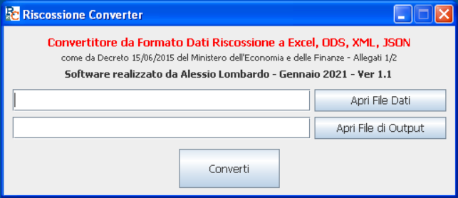
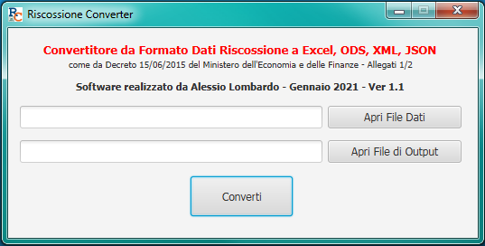
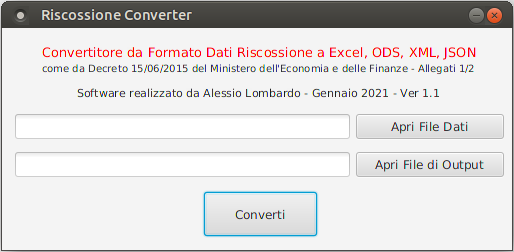

# RiscossioneConverter

RiscossioneConverter consente la conversione di un file a blocchi contenente record a lunghezza fissa secondo le specifiche degli [Allegati 1/2 del Decreto 15/06/2015 del Ministero dell'Economia e delle Finanze](https://www.gazzettaufficiale.it/atto/serie_generale/caricaDettaglioAtto/originario?atto.dataPubblicazioneGazzetta=2015-06-22&atto.codiceRedazionale=15A04675&elenco30giorni=false) inerente la trasmissione agli enti creditori delle quote annullate e di rimborso agli agenti della riscossione delle spese esecutive sostenute per i ruoli. I formati di output supportati sono Excel (.xlsx), Excel 97-2003 (.xls), OpenDocument Spreadsheet (.ods), XML e JSON.

Il software è interamente sviluppato in Java e con interfaccia grafica minimale disponibile in due versioni:
- Swing: Testata su Windows XP (con JRE7), Windows 7 (con JRE8), Windows 10 (con JDK15), Ubuntu 20.04 (con JDK11);
- JavaFX: Testata su Windows 7 (con JRE8), Windows 10 (con JDK15), Ubuntu 20.04 (con JDK11). Windows XP non supportato.

Gli output in formato .xls, .xlsx e .ods sono stati testati su Microsoft Excel 2013 e LibreOffice Calc 6.4.6.2.

L'approccio di programmazione MVC consente facilmente di estrarre/modificare/sostituire il modello dei dati, il formato di output o l'interfaccia grafica.

Se viene selezionato un file di output non vuoto, i record convertiti vengono inseriti in coda, senza alterare i record precedenti.

Bug noti e Troubleshooting:
- Ove la libreria JavaFX non fosse già integrata nel JDK/JRE, specificarla avviando il jar con:

```
	java --module-path <PERCORSO LIBRERIA JAVAFX> --add-modules=javafx.controls,javafx.fxml -jar <NOME JAR>
```

- Microsoft Excel richiede una correzione del contenuto del file generato se il formato scelto è ODS. Consentire la correzione e salvare da Excel per risolvere;
- Possibile ``OutOfMemoryError`` se il file di input ha una dimensione eccessiva. Eventualmente suddividerlo in porzioni.


Interfaccia Swing su Windows XP:



Interfaccia JavaFX su Windows 7:



Interfaccia JavaFX su Ubuntu 20.04:




[Documentazione API (Javadoc)](https://alessiolombardo.github.io/RiscossioneConverter/apidocs/)
